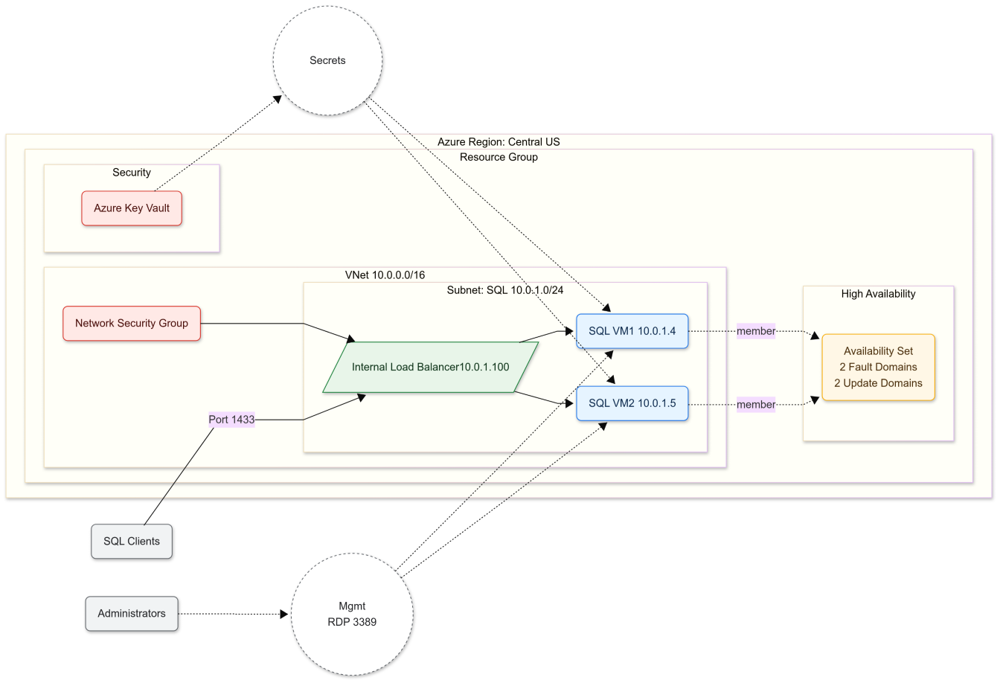
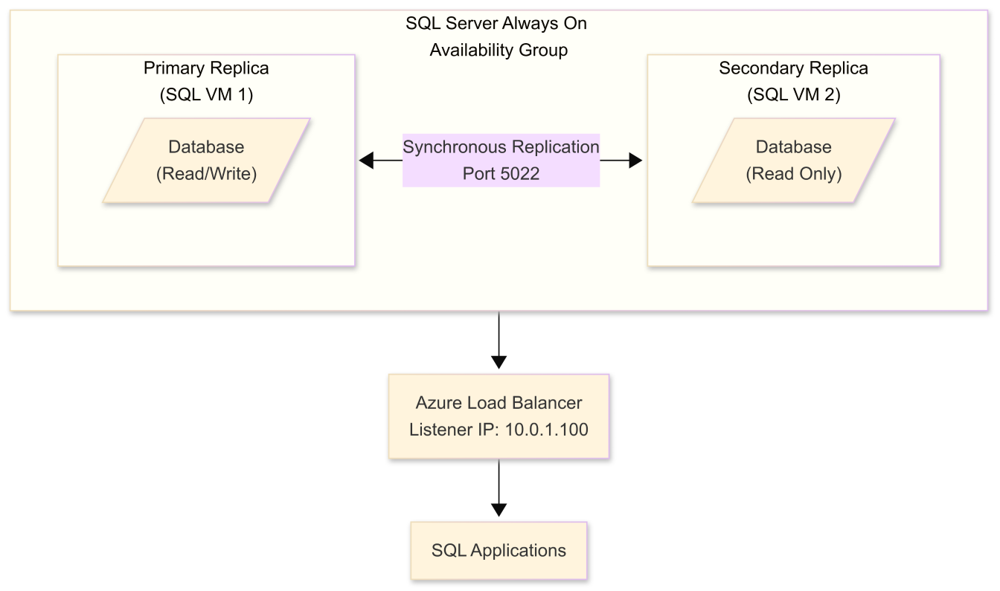

<!--
keywords: azure sql server, high availability, always on availability groups, azure deployment, sql server clustering, azure load balancer, infrastructure as code, bash automation, azure key vault, managed identities, disaster recovery, sql server 2019, azure networking, devops automation
-->

# Azure SQL Server High Availability Infrastructure Deployment {#top}

[](./LICENSE)
[](https://azure.microsoft.com)
[](https://www.microsoft.com/sql-server/sql-server-2019)
[](https://www.gnu.org/software/bash/)

> **Automated deployment of a production-ready SQL Server Always On Availability Groups infrastructure on Microsoft Azure.**
> Includes Azure Load Balancer configuration, Key Vault integration, Managed Identities, and comprehensive post-deployment guidance.

---

## Table of Contents

- [Overview](#overview)
- [What Gets Deployed](#what-gets-deployed)
- [Deployment Time](#deployment-time)
- [Prerequisites](#prerequisites)
  - [Required Tools](#required-tools)
  - [Azure Requirements](#azure-requirements)
  - [Quick Prerequisites Check](#quick-prerequisites-check)
- [Quick Start](#quick-start)
- [Architecture](#architecture)
  - [Network Topology](#network-topology)
  - [High Availability Design](#high-availability-design)
- [Features](#features)
  - [Security Features](#security-features)
  - [Performance Features](#performance-features)
  - [Operational Features](#operational-features)
- [Deployment Guide](#deployment-guide)
- [Post-Deployment Configuration](#post-deployment-configuration)
  - [Phase 1: Initial VM Access](#phase-1-initial-vm-access)
  - [Phase 2: Windows Failover Cluster](#phase-2-windows-failover-cluster)
  - [Phase 3: SQL Server Always On](#phase-3-sql-server-always-on)
  - [Phase 4: Configure AG Listener](#phase-4-configure-ag-listener)
- [Security](#security)
  - [Security Best Practices Implemented](#security-best-practices-implemented)
  - [Post-Deployment Security Hardening](#post-deployment-security-hardening)
- [Cost Analysis](#cost-analysis)
  - [Estimated Monthly Costs](#estimated-monthly-costs)
  - [Cost Optimization Strategies](#cost-optimization-strategies)
- [Troubleshooting](#troubleshooting)
  - [Common Issues and Solutions](#common-issues-and-solutions)
- [Best Practices](#best-practices)
- [FAQ](#faq)
- [Contributing](#contributing)
- [License](#license)
- [Changelog](#changelog)

---

## Overview

This solution provides a **one-click deployment** script that creates a complete SQL Server high availability infrastructure on Azure, following Microsoft best practices for security, networking, and high availability.

### What Gets Deployed 

- 2× SQL Server 2019 VMs in an Availability Set
- Azure Standard Load Balancer preconfigured for the AG Listener
- Virtual Network with custom subnet and NSG rules
- Azure Key Vault for secure credential management
- Managed Identities for enhanced security
- Premium SSD storage optimized for SQL Server workloads

### Deployment Time

- **Infrastructure:** ~15–20 minutes
- **Post-configuration:** ~30–45 minutes (manual)

---

## Prerequisites

### Required Tools

| Tool       | Minimum Version | Installation Guide                                                                 |
|------------|------------------|-------------------------------------------------------------------------------------|
| Azure CLI  | 2.40.0+          | https://learn.microsoft.com/cli/azure/install-azure-cli                          |
| Bash       | 4.0+             | Included in Linux/macOS, or use WSL on Windows: https://learn.microsoft.com/windows/wsl/install |
| curl       | Any              | Usually pre-installed                                                              |

### Azure Requirements 

- Active Azure Subscription
- Contributor or Owner role on the subscription
- Available quota for:
  - 2× Standard_D2s_v3 VMs
  - 1× Standard Load Balancer
  - 6× Premium SSD disks

### Quick Prerequisites Check 

```bash
# Check Azure CLI
az --version

# Check Azure login
az account show

# Check available VM quota
az vm list-usage --location centralus   --query "[?name.value=='standardDSv3Family'].{Name:name.value, Current:currentValue, Limit:limit}" -o table
```

---

## Quick Start

1. **Download and run**

```bash
# Download the script
curl -O https://raw.githubusercontent.com/yourusername/azure-sql-ha/main/deploy-sql-vms-simple.sh

# Make it executable
chmod +x deploy-sql-vms-simple.sh

# Run the deployment
./deploy-sql-vms-simple.sh
```

2. **What happens next**

The script will:

- Generate unique resource names with timestamp
- Create all Azure resources
- Configure networking and security
- Store credentials securely in Key Vault
- Output connection information
- Save deployment details to a file

---

## Architecture

### Network Topology 



### High Availability Design 



---

## Features

### Security Features 

- Azure Key Vault integration: all credentials stored securely
- Managed Identities: no passwords in code or config files
- Network isolation: custom VNet with strict NSG rules
- Temporary Public IPs: only for initial configuration, easily removed
- Role-based access: VMs have minimal required permissions

### Performance Features 

- Premium SSD storage: optimized for SQL Server workloads
- Availability Sets: protection against hardware failures
- Standard Load Balancer: high performance and reliability
- SQL VM Resource Provider: automated patching and backups

### Operational Features 

- Automated deployment: single script execution
- Idempotent operations: safe to re-run
- Comprehensive logging: color-coded output for easy tracking
- Deployment records: timestamped files with all details
- Error recovery: graceful handling with cleanup guidance

---

## Deployment Guide

### 1. Pre-Deployment Checklist

```bash
# Login to Azure
az login

# Set subscription (if multiple)
az account set --subscription "Your Subscription Name"

# Verify subscription
az account show --query "{Name:name, ID:id, State:state}" -o table
```

### 2. Customize Deployment (Optional)

Edit the script to modify defaults:

```bash
# Default values you can change
LOCATION="centralus"            # Azure region
VM_SIZE="Standard_D2s_v3"       # VM size
ADMIN_USERNAME="sqladmin"       # Admin username
```

### 3. Run Deployment

```bash
./deploy-sql-vms-simple.sh
```

### 4. Monitor Progress

The script provides real-time status updates:

```text
✓ Resource group creation completed successfully
✓ Key Vault creation completed successfully
✓ Virtual network creation completed successfully
... (continues for all resources)
```

### 5. Access Deployment Information

```bash
# View the generated deployment file
cat deployment-info-[TIMESTAMP].txt

# Retrieve credentials
az keyvault secret show --vault-name <YOUR-KEYVAULT> --name sql-admin-password --query value -o tsv
```

---

## Post-Deployment Configuration 

### Phase 1: Initial VM Access 

1. **Connect to VMs**

```bash
# From Windows
mstsc /v:<VM-PUBLIC-IP>

# From macOS/Linux
# Use Microsoft Remote Desktop or equivalent RDP client
```

2. **Configure Firewall Rules (run on both VMs)**

```powershell
# Allow SQL Server
New-NetFirewallRule -DisplayName "SQL Server" -Direction Inbound -Protocol TCP -LocalPort 1433 -Action Allow

# Allow AG Endpoint
New-NetFirewallRule -DisplayName "AG Endpoint" -Direction Inbound -Protocol TCP -LocalPort 5022 -Action Allow

# Allow Probe Port
New-NetFirewallRule -DisplayName "SQL Probe Port" -Direction Inbound -Protocol TCP -LocalPort 59999 -Action Allow
```

### Phase 2: Windows Failover Cluster

1. **Install Clustering Feature (both VMs)**

```powershell
Install-WindowsFeature -Name Failover-Clustering -IncludeManagementTools
Restart-Computer
```

2. **Create Cluster (run from VM1)**

```powershell
New-Cluster -Name SQLCLUSTER -Node sqlvm1,sqlvm2 -NoStorage

# Configure for Azure
(Get-Cluster).SameSubnetDelay = 2000
(Get-Cluster).SameSubnetThreshold = 15
```

### Phase 3: SQL Server Always On 

1. **Enable Always On (both VMs)**

- Open SQL Server Configuration Manager
- Right-click SQL Server service → Properties
- Enable Always On Availability Groups
- Restart the SQL Server service

2. **Create AG Endpoints (both VMs)**

```sql
CREATE ENDPOINT [Hadr_endpoint]
STATE = STARTED
AS TCP (LISTENER_PORT = 5022)
FOR DATA_MIRRORING (
    ROLE = ALL,
    ENCRYPTION = REQUIRED ALGORITHM AES
);
```

3. **Create Availability Group (primary only)**

```sql
-- Create sample database
CREATE DATABASE TestDB;
GO

-- Full backup (required for AG)
BACKUP DATABASE TestDB TO DISK = 'C:\\Backup\\TestDB.bak';
GO

-- Create AG
CREATE AVAILABILITY GROUP [TestAG]
FOR DATABASE [TestDB]
REPLICA ON 
    'sqlvm1' WITH (ENDPOINT_URL = 'TCP://sqlvm1:5022',
        AVAILABILITY_MODE = SYNCHRONOUS_COMMIT,
        FAILOVER_MODE = AUTOMATIC),
    'sqlvm2' WITH (ENDPOINT_URL = 'TCP://sqlvm2:5022',
        AVAILABILITY_MODE = SYNCHRONOUS_COMMIT,
        FAILOVER_MODE = AUTOMATIC);
```

### Phase 4: Configure AG Listener 

1. **Create Listener (primary)**

```sql
ALTER AVAILABILITY GROUP [TestAG]
ADD LISTENER 'AGListener' (
    WITH IP (("10.0.1.100", '255.255.255.0')),
    PORT = 1433
);
```

2. **Configure Cluster Parameters (PowerShell on any node)**

```powershell
$ClusterNetworkName = "Cluster Network 1"
$IPResourceName     = "AGListener_10.0.1.100"
$ListenerILBIP      = "10.0.1.100"
[int]$ProbePort     = 59999

Import-Module FailoverClusters
Get-ClusterResource $IPResourceName | Set-ClusterParameter -Multiple @{
    Address     = $ListenerILBIP;
    ProbePort   = $ProbePort;
    SubnetMask  = "255.255.255.255";
    Network     = $ClusterNetworkName;
    EnableDhcp  = 0
}
```

---

## Security 

### Security Best Practices Implemented {#security-best-practices-implemented}

| Feature               | Implementation            | Benefit                          |
|-----------------------|---------------------------|----------------------------------|
| Credential Management | Azure Key Vault           | No hardcoded passwords           |
| Network Security      | Custom NSG rules          | Minimal attack surface           |
| Identity Management   | Managed Identities        | No credential rotation needed    |
| Access Control        | RBAC + Key Vault policies | Principle of least privilege     |
| Encryption            | TLS for AG endpoints      | Data in transit protection       |

### Post-Deployment Security Hardening 

1. **Remove Public IPs**

```bash
az network public-ip delete -g <RESOURCE-GROUP> -n sqlvm1-pip --yes
az network public-ip delete -g <RESOURCE-GROUP> -n sqlvm2-pip --yes
```

2. **Enable Azure Bastion (recommended)**

```bash
az network bastion create   --name sql-bastion   --public-ip-address sql-bastion-pip   --resource-group <RESOURCE-GROUP>   --vnet-name sql-vnet
```

3. **Configure SQL Server Security**

- Change default SA password
- Disable SA account if not needed
- Enable SQL Server audit logging
- Configure Transparent Data Encryption (TDE)

---

## Cost Analysis 

### Estimated Monthly Costs (Central US Region) 

| Resource       | Specification                                   | Est. Monthly Cost |
|----------------|--------------------------------------------------|-------------------:|
| 2× SQL VMs     | Standard_D2s_v3 (2 vCPU, 8 GB RAM)               | $280               |
| Storage        | 2× OS (128 GB) + 4× Data (128 GB + 256 GB each)  | $140               |
| Load Balancer  | Standard SKU                                     | $25                |
| Key Vault      | Standard tier, minimal transactions              | <$1                |
| Network        | Bandwidth (est. 100 GB/month)                    | $9                 |
| **Total**      |                                                  | **~$455/month**    |

### Cost Optimization Strategies

**Development/Test Environments**

- Use B-series VMs: save ~40%
- Schedule auto-shutdown: save ~50%
- Use Dev/Test subscription: save ~55%

**Production Environments**

- Reserved Instances (1-year): save ~40%
- Reserved Instances (3-year): save ~60%
- Azure Hybrid Benefit: save ~40%

**Storage Optimization**

- Use Standard SSD for non-critical workloads
- Implement data compression
- Archive old backups to Cool storage

---

## Troubleshooting 

### Common Issues and Solutions 

**1. Cluster Creation Fails**

```powershell
# Validate cluster configuration
Test-Cluster -Node sqlvm1,sqlvm2

# Check Windows Firewall
Get-NetFirewallRule | Where-Object DisplayName -like "*Cluster*"

# Verify network connectivity
Test-NetConnection -ComputerName sqlvm2 -Port 3343
```

**2. AG Listener Not Responding**

```powershell
# Check cluster resource state
Get-ClusterResource | Where-Object ResourceType -eq "IP Address"

# Verify probe port response
netstat -an | findstr 59999

# Test load balancer health probe
Test-NetConnection -ComputerName 10.0.1.100 -Port 59999
```

**3. SQL Connection Timeouts**

```sql
-- Check AG state
SELECT * FROM sys.availability_groups_cluster;
SELECT * FROM sys.dm_hadr_availability_replica_states;

-- Verify listener configuration
SELECT * FROM sys.availability_group_listeners;
```

**Diagnostic Commands Reference**

```bash
# Azure CLI diagnostics
az vm show -g <RG> -n sqlvm1 --query "[provisioningState, vmId]"
az network lb show -g <RG> -n sql-lb --query provisioningState
```

```powershell
# PowerShell diagnostics (on VMs)
Get-Cluster | Format-List *
Get-ClusterNode | Format-List *
Get-ClusterResource | Format-List *
```

```sql
-- SQL Server diagnostics
SELECT @@SERVERNAME, @@VERSION;
EXEC sp_helpserver;
```

---

## Best Practices 

**Pre-Deployment**

- Verify Azure quotas and limits
- Plan IP addressing scheme
- Document security requirements
- Prepare runbooks for operations

**During Deployment**

- Monitor Azure Activity Log
- Save all output logs
- Test connectivity after each phase
- Document any customizations

**Post-Deployment**

- Configure monitoring and alerts
- Implement backup strategy
- Schedule patching windows
- Create a disaster recovery plan

---

## FAQ

**General Questions**

- **Q:** Can I change the Azure region?  
  **A:** Yes, modify the `LOCATION` variable in the script. Ensure the region supports all required services.

- **Q:** Can I use different VM sizes?  
  **A:** Yes, modify the `VM_SIZE` variable. Ensure the size supports Premium storage.

- **Q:** How do I add more replicas?  
  **A:** The script creates 2 VMs. For more replicas, extend the VM creation loop and adjust availability set fault domains.

**Technical Questions**

- **Q:** Why is a load balancer needed?  
  **A:** Azure doesn't support gratuitous ARP; a load balancer provides the virtual IP for the AG listener.

- **Q:** Can I use a Basic tier load balancer?  
  **A:** No. Standard tier is required for the features needed by SQL Server AG.

- **Q:** What's the probe port for?  
  **A:** The probe port (`59999`) lets the load balancer detect which replica is primary.

**Troubleshooting Questions**

- **Q:** My deployment failed. How do I clean up?  
  **A:** `az group delete --name <RESOURCE-GROUP> --yes`

- **Q:** I can't RDP to the VMs. What should I check?  
  **A:** Verify your public IP, check NSG rules, and ensure VMs are running.

- **Q:** The AG listener isn't working. What's wrong?  
  **A:** Check cluster resource state, verify probe port configuration, and ensure the load balancer backend pool has both VMs.

---

## Contributing 

We welcome contributions! Please see the CONTRIBUTING.md for details.

**How to contribute:**

1. Fork the repository
2. Create a feature branch: `git checkout -b feature/AmazingFeature`
3. Commit your changes: `git commit -m "Add some AmazingFeature"`
4. Push to the branch: `git push origin feature/AmazingFeature`
5. Open a Pull Request

**Code style:**

1. Use consistent indentation (4 spaces)
2. Add comments for complex logic
3. Follow Bash best practices
4. Test your changes thoroughly

⭐ If you find this helpful, please star the repository!

---

## License

This project is licensed under the MIT License – see the LICENSE file for details.

---

<p align="right"><a href="#top">⬆️ Back to top</a></p>
